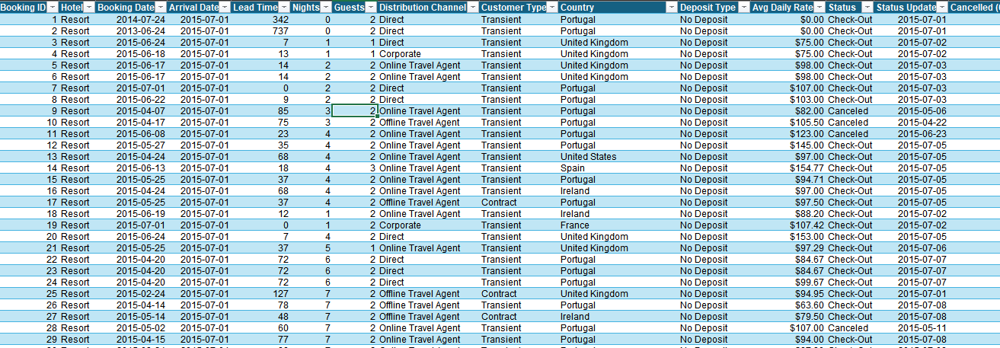
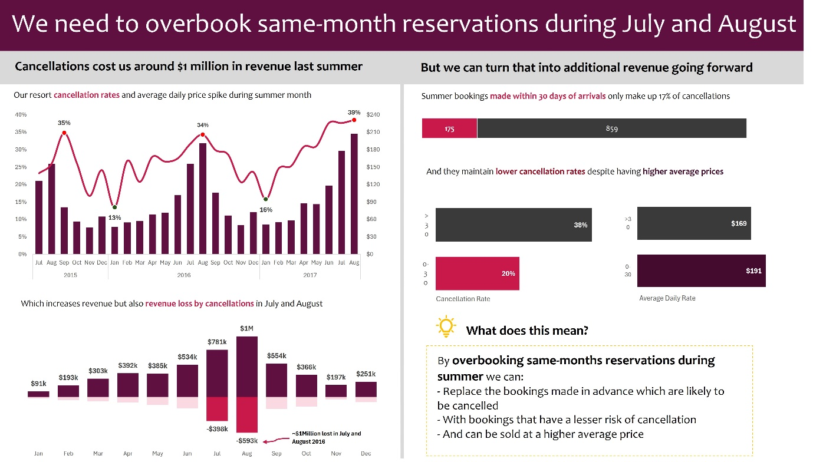

# SHG Hotel Booking Cancellations

**An Analysis of Reservation Cancellations, Seasonality, and Lead Time**
Author: Joseph Dolapo · Tool: Microsoft Excel (PivotTables, Executive Insight Dashboard) · Date: October 2026

A one-page Excel executive-insight dashboard analysing 119,390 hotel reservations to answer one business question: why cancellations spike every July and August, what it costs, and what to do about it.

---

## Table of Contents

1. [Executive Summary](#1-executive-summary)
2. [Project Overview](#2-project-overview)
3. [Data Overview](#3-data-overview)
4. [Methodology](#4-methodology)
5. [Task 1 — Cancellation Rate and ADR by Month](#5-task-1--cancellation-rate-and-adr-by-month)
6. [Task 2 — Monthly Revenue Lost to Cancellations](#6-task-2--monthly-revenue-lost-to-cancellations)
7. [Task 3 — Cancellation Rate and ADR by Booking Lead Time](#7-task-3--cancellation-rate-and-adr-by-booking-lead-time)
8. [Task 4 — Recommendation](#8-task-4--recommendation-overbook-same-month-summer-reservations)
9. [Dashboard Design](#9-dashboard-design)
10. [Key Insights and Findings](#10-key-insights-and-findings)
11. [How to Explore This Project](#11-how-to-explore-this-project)
12. [Conclusion](#12-conclusion)

---

## 1. Executive Summary

This project analyses 119,390 hotel reservation records for the SHG hotel group, covering two properties — a City hotel and a Resort hotel — with arrivals between 2015 and 2017. Rather than a general KPI overview, the dashboard was built as a **one-page executive insight report**: it leads with a specific recommendation — *"We need to overbook same-month reservations during July and August"* — and backs it with just enough evidence to make the case.

The headline finding: cancellations cost the hotel group an estimated **$1 million** in lost revenue during the summer of 2016 alone. Investigating booking lead time showed that bookings made far in advance are both more likely to cancel *and* less profitable than last-minute bookings — the basis for the overbooking recommendation.

| Metric                                                  | Value          |
|-----------------------------------------------------------|----------------|
| Total Bookings Analysed                                   | 119,390        |
| Overall Cancellation Rate                                  | 37%            |
| Properties Covered                                         | City, Resort   |
| Date Range (Arrivals)                                       | 2015 – 2017    |
| Estimated Revenue Lost, Summer 2016                         | ~$1,000,000    |
| Cancellation Rate — Bookings Made 0–30 Days Before Arrival  | 20%            |
| Cancellation Rate — Bookings Made 30+ Days Before Arrival   | 38%            |

---

## 2. Project Overview

### 2.1 Background

Hotel reservation systems log every booking made, whether or not the guest arrives. This project investigates one specific, high-value pattern in that log: seasonal cancellation behaviour, what it costs, and what operational change would recover it.

### 2.2 Project Objectives

No separate task brief was supplied for this project — only the dataset and the finished dashboard. The following four objectives were reconstructed directly from the dashboard's own findings:

- Examine how cancellation rate and average daily rate (ADR) move together across months and years
- Quantify the revenue lost to cancellations on a monthly basis
- Compare cancellation rate and ADR between bookings made within 30 days of arrival versus more than 30 days in advance
- Translate the findings into a concrete recommendation for the July–August peak season

### 2.3 Technology and Tools

| Component            | Tool / Technique                                    | Purpose                                                             |
|------------------------|-------------------------------------------------------|----------------------------------------------------------------------|
| Data Source            | Excel table of 119,390 hotel booking records          | Raw booking-level transactional data                                 |
| Data Preparation       | Excel Tables, helper columns, date functions          | Deriving month/year, lead-time buckets, and cancellation flags        |
| Aggregation Engine     | PivotTables                                           | Summarising cancellation rate, ADR, and revenue loss                   |
| Visualisation          | Combo charts (bar + line), waterfall-style stacked bar| Cancellation rate vs. ADR; monthly revenue vs. revenue lost            |
| Dashboard Layout       | Single-slide executive insight format                 | Leading with a recommendation, backed by two evidence panels           |

---

## 3. Data Overview

### 3.1 Dataset Structure

The source dataset is booking-level, one row per reservation.

*Figure 1 — Sample of the raw SHG booking dataset.*

### 3.2 Data Characteristics

| Field                    | Description                                                                          |
|----------------------------|--------------------------------------------------------------------------------------|
| Booking ID                 | Unique identifier for each reservation                                               |
| Hotel                       | Property — City or Resort                                                            |
| Booking Date / Arrival Date | Date reserved, and date the guest was due to arrive                                   |
| Lead Time                   | Days between booking date and arrival date                                            |
| Nights / Guests             | Length of stay and guest count                                                        |
| Distribution Channel        | Direct, Corporate, Online Travel Agent, Offline Travel Agent                           |
| Customer Type               | Transient, Transient-Party, Contract, or Group                                        |
| Country                     | Guest's country of origin                                                             |
| Deposit Type                | Whether a deposit was required                                                        |
| Avg Daily Rate (ADR)        | Average nightly rate charged                                                           |
| Status / Status Update      | Check-Out, Canceled, or No-Show, and the date recorded                                |
| Cancelled (0/1)             | Binary cancellation flag                                                              |
| Revenue / Revenue Loss      | Revenue realised, and revenue lost if cancelled                                       |

Of all 119,390 bookings, **79,330 (66%)** were for the City hotel and **40,060 (34%)** for the Resort hotel. **75,166** resulted in a completed check-out, **43,017** were cancelled, and **1,207** were no-shows — an overall cancellation rate of **37%**. Online Travel Agents are the dominant channel at **62%** of all bookings.

### 3.3 Data Preparation Steps

- Converted the raw range into a formatted Excel Table for PivotTable reference
- Derived Month/Year helper columns from Arrival Date
- Derived a Lead-Time Bucket helper column (0–30 days vs. 30+ days)
- Verified Cancelled (0/1) and Revenue Loss fields were consistent across the dataset

---

## 4. Methodology

- Built a PivotTable grouping bookings by Month and Year, with Cancellation Rate and ADR as Values, to produce the cancellation-rate-vs-ADR combo chart
- Built a second PivotTable summing Revenue and Revenue Loss by Month and Year, to produce the monthly revenue/revenue-loss chart
- Built a third PivotTable splitting July–August bookings into 0–30-day and 30+-day lead-time buckets, calculating cancellation count, rate, and average ADR for each
- Assembled all three onto a single dashboard sheet, led by a headline recommendation banner rather than a neutral title

---

## 5. Task 1 — Cancellation Rate and ADR by Month

Cancellation rate and ADR rise and fall together, peaking every July and August: **35%** cancellation rate in August 2015, dropping to **13%** in January 2016, climbing to **34%** in August 2016, dropping to **16%** in January 2017, and reaching **39%** in August 2017. ADR follows the same curve, from ~$90 in low season to over $210 at the August 2017 peak — meaning the hotel group's highest-rate months are also its highest-cancellation-risk months.

---

## 6. Task 2 — Monthly Revenue Lost to Cancellations

Revenue lost to cancellations grows every year in July and August — **~$398k** lost in July 2016, peaking at **~$593k** lost in August 2016, combining for an estimated **$1 million** lost across those two months in 2016 alone. This is a recurring, predictable, seven-figure annual loss concentrated in just two months.

---

## 7. Task 3 — Cancellation Rate and ADR by Booking Lead Time

| Booking Window              | Cancellation Rate | Average Daily Rate |
|-------------------------------|---------------------|----------------------|
| 0–30 days before arrival      | 20%                 | $191                 |
| 30+ days before arrival       | 38%                 | $169                 |

Of all summer cancellations, bookings made within 30 days of arrival accounted for only **175** cancellations against **859** for bookings made further in advance — meaning far-in-advance bookings make up roughly **83%** of all summer cancellations. Bookings made closer to arrival are both less likely to cancel *and* command a higher rate.

---

## 8. Task 4 — Recommendation: Overbook Same-Month Summer Reservations

Because far-in-advance summer bookings are more likely to cancel and less profitable than last-minute bookings, the hotel group can intentionally overbook rooms during July and August by:

- Replacing the far-in-advance bookings statistically likely to cancel (38% cancellation rate)
- With near-arrival bookings carrying a lower cancellation risk (20%)
- Sold at a higher average daily rate ($191 vs. $169)

Executed carefully, this converts the ~$1 million currently lost each summer into recovered occupancy and additional margin, without materially increasing the risk of a true walk-in "oversell," given how reliably the pattern recurs year over year.

---

## 9. Dashboard Design

*Figure 2 — The completed one-page executive insight dashboard.*

### 9.1 Layout Logic

- **Header banner:** states the recommendation directly, before any evidence
- **Sub-header band:** "the problem" (left) vs. "the opportunity" (right)
- **Left column:** cancellation-rate-vs-ADR chart, then monthly revenue/revenue-loss chart
- **Right column:** lead-time cancellation comparison, then a highlighted "What does this mean?" recommendation callout

### 9.2 Formatting Choices

- Deep maroon and dark grey palette, with bright magenta/pink reserved for cancellation figures
- Data labels on every bar and line point — no legend required
- Dashed-line annotation calling out the ~$1 million loss figure
- Recommendation callout visually separated with a dashed gold border and light-bulb icon

---

## 10. Key Insights and Findings

- Cancellation rate and ADR peak together every July and August — the highest-revenue months are also the highest-risk months
- Cancellations in July and August 2016 alone cost an estimated $1 million in lost revenue
- Bookings made 30+ days before arrival are nearly twice as likely to cancel as bookings made within 30 days (38% vs. 20%)
- Near-arrival bookings also command a higher ADR ($191 vs. $169) — no revenue trade-off in favouring them
- Far-in-advance bookings account for ~83% of all summer cancellations, making them a predictable, plannable source of recoverable inventory

---

## 11. How to Explore This Project

1. Open **SHG_Data.xlsx** in Microsoft Excel
2. Review the raw booking data, then explore each PivotTable/chart sheet behind the dashboard
3. Click **Data → Refresh All** to recalculate the dashboard from source
4. Read **SHG_Hotel_Cancellations_Report.docx** for the full write-up of methodology, findings, and the overbooking recommendation

---

## 12. Conclusion

The SHG Hotel Booking Cancellations dashboard shows the value of building around a single, specific recommendation rather than a general metrics overview. By tracing cancellation rate, ADR, and revenue loss across three years of data, then isolating booking lead time as the lever behind the pattern, the analysis turns a recurring ~$1 million annual loss into a concrete, data-backed overbooking strategy for the hotel group's two highest-stakes months.

---

*Author: Joseph Dolapo — SHG Hotel Booking Cancellations Project, October 2026.*
